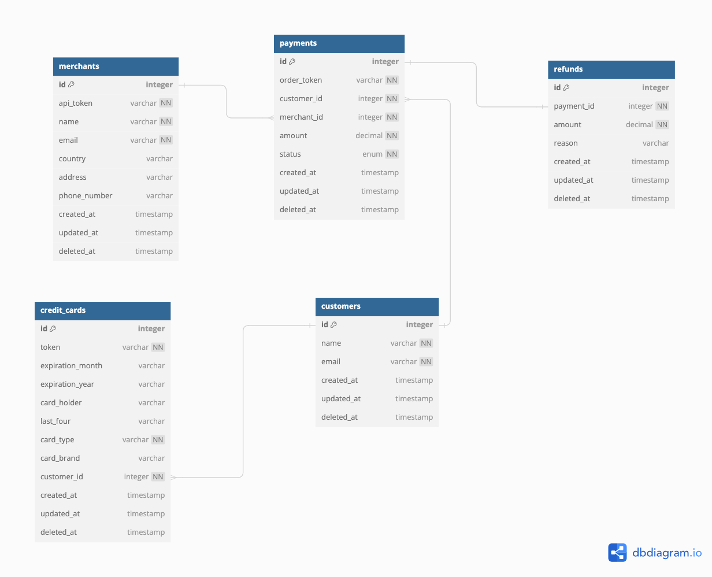
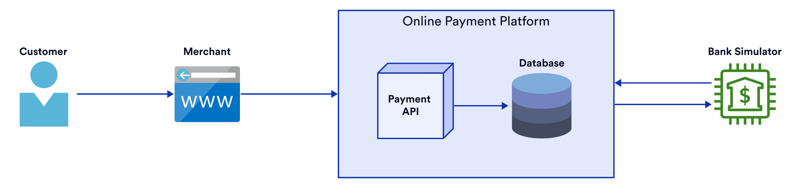

#  Online Payment Platform

With the rapid expansion of e-commerce, there is a pressing need for an efficient payment gateway. This project aims to develop an online payment platform, which will be an API-based application enabling e-commerce businesses to securely and seamlessly process transactions.

## Execution of the Solution

### Dependencies
- Docker and Docker Compose

### Running Locally
Execute the following steps to launch the application in your local environment:
1. Navigate to the root of the project
2. Execute the following command:
```
$ make run-local
```

### Accesing the endpoints
- The Payment Application will be available on http://localhost:8080/
- The Bank Simulator will be available on http://localhost:8090/

## API Documentation
You can access the Swagger documentation for this application [docs/application.yml](docs/application.yml).

## Database Diagram


## Architecture Diagram


## Areas for Improvement
1. **Queue System for Request Handling**: Implementing a queue system, such as RabbitMQ or Kafka, can enhance the platform's ability to handle incoming requests efficiently. By decoupling request processing from the main application logic, a queue system allows for better scalability, fault tolerance, and asynchronous processing.
2. **Observability**: Consider implementing OpenTelemetry for distributed tracing and observability. OpenTelemetry provides a standardized approach to instrumenting applications for collecting telemetry data, including metrics, logs, and traces. By integrating OpenTelemetry, the platform can gain insights into performance bottlenecks, dependencies, and system behavior, enabling better troubleshooting, optimization, and monitoring of the application's performance and reliability.
3. **Security**: Enhance security measures to protect sensitive customer and payment data from unauthorized access, breaches, and fraud. This may involve implementing encryption, tokenization, and secure authentication mechanisms.
4. **Scalability**: To enhance scalability, we can implement horizontal scaling by adding more instances of the application across multiple servers, complemented by load balancing to evenly distribute incoming requests. We can also use containerization and orchestration technologies like Kubernetes to streamline deployment and management. Also scaling the database layer and caching frequently accessed data can further optimize performance and reduce latency. 

## Authentication and Security
Due to time limit, a comprehensive authentication and security mechanism could not be fully implemented in the initial version of the online payment platform. However, one potential approach for implementing authentication is through the use of JSON Web Tokens (JWT). JWT provides a stateless authentication mechanism that can securely transmit information between parties as a JSON object. By generating JWT tokens upon successful authentication, the platform can validate the identity of users and authorize access to protected resources. 

## Audit Trail
Due to time limit,  an audit trail feature to track activities such as payment processing, queries for payment details, and refunds could not be fully implemented in the initial version of the online payment platform. However, one potential solution for implementing this feature in future iterations could be leveraging a NoSQL database like MongoDB. MongoDB's flexible schema and document-oriented nature make it well-suited for storing audit trail data, allowing for efficient tracking and retrieval of transaction-related activities.

## Cloud Technologies
The project did not utilize any specific cloud technology. Instead, it relied on MySQL as the chosen database technology. MySQL was selected for its reliability and ease of use. By opting for MySQL, the project benefitted from a robust relational database management system that offers ACID compliance, strong data consistency, and extensive support for complex queries and transactions. 

## TODO
Due to time constraints during the initial implementation phase, certain crucial aspects of the online payment platform were not fully addressed.
- Implement comprehensive unit tests for all components, including handlers, services, and repository methods, to ensure proper functionality, error handling, and edge case coverage. Unit tests should cover various scenarios such as successful requests, error cases, and boundary conditions to validate the behavior of each component.
- Implement request validation mechanisms to ensure that incoming requests adhere to defined specifications and constraints. Request validation should include checking for required fields, data formats, and input ranges to prevent invalid or malicious data from being processed by the application. Validation should be performed at the API level using middleware or request validation libraries to enforce data integrity and security.
